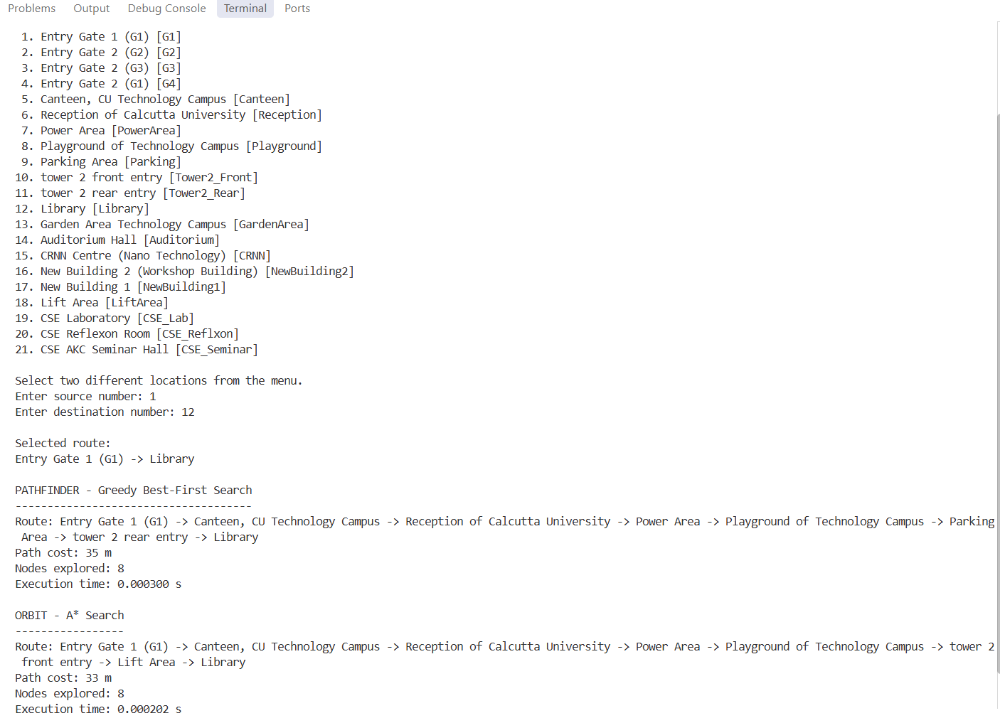
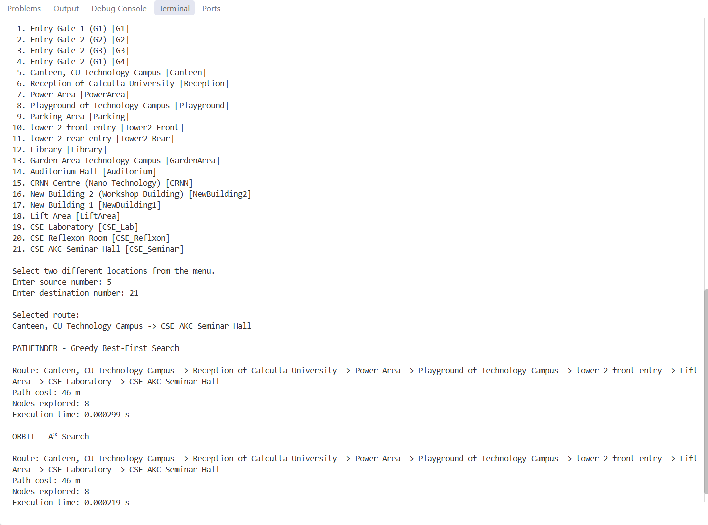
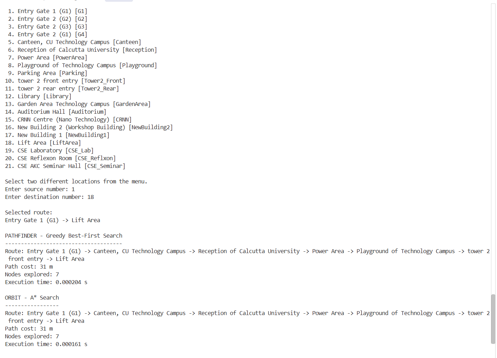

# AI Campus Route Navigator

**Assignment:** X_03 — AI/ML Laboratory (B.Tech. 5th Semester)  
**Campus:** University of Calcutta (Technology Campus)

---

## Overview

This project implements an AI-based campus navigation system for the CU Technology Campus based on its satellite map layout. The campus map is converted into an undirected weighted graph where nodes represent real campus locations and edge weights correspond to walking distances (in meters).

The system compares two heuristic search algorithms to answer the question:
> **"Does the path that looks closest to the destination also produce the best route?"**

The two routing agents implemented are:
- **PATHFINDER:** Greedy Best-First Search (`f(n) = h(n)`)
- **ORBIT:** A* Search (`f(n) = g(n) + h(n)`)

Both agents use the same heuristic function and must follow real-world campus constraints, including a special entry/exit rule for the Computer Science & Engineering (CSE) zone.

---

## Campus Locations

All 21 locations are mapped directly from the satellite map without adding any extra nodes. The graph connections and walking distances are stored in `campus.json`.

| Node Code | Location Name |
| :--- | :--- |
| `G1` | Entry Gate 1 (G1) |
| `G2` | Entry Gate 2 (G2) |
| `G3` | Entry Gate 2 (G3) |
| `G4` | Entry Gate 2 (G1) |
| `Canteen` | Canteen, CU Technology Campus |
| `Reception` | Reception of Calcutta University |
| `PowerArea` | Power Area |
| `Playground` | Playground of Technology Campus |
| `Parking` | Parking Area |
| `Tower2_Front` | tower 2 front entry |
| `Tower2_Rear` | tower 2 rear entry |
| `Library` | Library |
| `GardenArea` | Garden Area Technology Campus |
| `Auditorium` | Auditorium Hall |
| `CRNN` | CRNN Centre (Nano Technology) |
| `NewBuilding1` | New Building 1 |
| `NewBuilding2` | New Building 2 (Workshop Building) |
| `LiftArea` | Lift Area |
| `CSE_Lab` | CSE Laboratory |
| `CSE_Reflxon` | CSE Reflexon Room |
| `CSE_Seminar` | CSE AKC Seminar Hall |

---

## Search Algorithms & Heuristic

### Heuristic Function (`h(n)`)
The heuristic represents the estimated remaining distance from any current node to the destination. In this implementation, `h(n)` is calculated as the shortest unconstrained distance on the campus graph (computed dynamically via Dijkstra's algorithm without the CSE zone restrictions). Because relaxing constraints can never overestimate the true path distance, this heuristic is both **admissible** (`h(n) <= h*(n)`) and **consistent**.

### Agents
1. **PATHFINDER (Greedy Best-First Search):**
   - Evaluation function: `f(n) = h(n)`
   - Always expands the node that appears closest to the goal based only on the heuristic estimate.
   - Faster in some cases, but does not guarantee the shortest route because it ignores the cost already travelled (`g(n)`).

2. **ORBIT (A* Search):**
   - Evaluation function: `f(n) = g(n) + h(n)`
   - Considers both the actual cost travelled so far (`g(n)`) and the estimated remaining distance (`h(n)`).
   - Guarantees finding the optimal (shortest) path when using an admissible heuristic.

---

## Special CSE Routing Rule

The following locations form the CSE zone:
- `CSE Laboratory`
- `CSE_AKC Seminar Hall`
- `CSE_Reflxon Room`

To reach or leave these locations, the route must respect the physical layout of the building:

1. **Entering the CSE zone:**
   ```
   Tower 2 Front/Rear Entry -> Lift Area -> CSE-labelled locations
   ```
   Once the Lift Area has been crossed during entry, only CSE-labelled locations may be visited until returning to the Lift Area.

2. **Exiting the CSE zone:**
   ```
   CSE-labelled locations -> Lift Area -> Tower 2 Front/Rear Entry -> Other campus locations
   ```

A path like `Lift Area -> CSE Laboratory -> Garden Area -> Library` is invalid because Garden Area is outside the CSE zone and cannot be accessed directly from the lab. The search algorithm filters valid neighboring moves based on this rule.

---

## Project Structure

The project is structured into separate modules using OOP principles:

```
campus-navigator/
├── campus.json       # Graph data: nodes, connections, and walking distances
├── campus_map.py     # CampusMap class: loads JSON, graph neighbors, heuristic, CSE rule validation
├── search.py         # SearchEngine & SearchResult classes: priority queue implementation of Greedy & A*
├── agents.py         # Pathfinder and Orbit agent wrapper classes
├── main.py           # Interactive CLI user interface
├── experiment.py     # Batch testing script that runs multiple test routes
├── results.csv       # Output file storing experiment results
├── screenshot/       # Terminal execution screenshots
└── README.md         # Project documentation
```

---

## How to Run

Requirements: Python 3.8+ (uses standard libraries only, no external packages needed).

### 1. Interactive Route Navigation
Run `main.py` to test routes interactively:
```bash
python main.py
```
- A numbered menu of all 21 locations will be displayed.
- Enter the number corresponding to your starting location.
- Enter the number corresponding to your destination.
- The program prints the route, total path cost (in meters), number of nodes explored, and execution time for both PATHFINDER and ORBIT.

### 2. Running Route Experiments
To run multiple experiments and log the data to `results.csv`:
```bash
python experiment.py
```
- Enter how many experiments you want to test.
- Select source and destination numbers.
- Results are saved to `results.csv`.

---

## Experimental Results

The following routes were tested to compare both agents on both regular campus paths and CSE-constrained paths:

| Route (Source -> Destination) | Agent | Path Taken | Cost (m) | Nodes Explored | Execution Time (s) |
| :--- | :--- | :--- | :---: | :---: | :---: |
| **Reception -> Library** | PATHFINDER | Reception -> PowerArea -> Playground -> Parking -> Tower2_Rear -> Library | 27 m | 6 | 0.000218 s |
| | ORBIT (A*) | Reception -> PowerArea -> Playground -> Tower2_Front -> LiftArea -> Library | 25 m | 6 | 0.000191 s |
| **Library -> Canteen** | PATHFINDER | Library -> Tower2_Rear -> Parking -> Playground -> PowerArea -> Reception -> Canteen | 31 m | 7 | 0.000202 s |
| | ORBIT (A*) | Library -> LiftArea -> Tower2_Front -> Playground -> PowerArea -> Reception -> Canteen | 29 m | 7 | 0.000238 s |
| **Gate 1 -> Library** | PATHFINDER | G1 -> Canteen -> Reception -> PowerArea -> Playground -> Parking -> Tower2_Rear -> Library | 35 m | 8 | 0.000286 s |
| | ORBIT (A*) | G1 -> Canteen -> Reception -> PowerArea -> Playground -> Tower2_Front -> LiftArea -> Library | 33 m | 8 | 0.000252 s |
| **Canteen -> New Building 2** | PATHFINDER | Canteen -> G1 -> Auditorium -> NewBuilding2 | 21 m | 4 | 0.000102 s |
| | ORBIT (A*) | Canteen -> G1 -> Auditorium -> NewBuilding2 | 21 m | 4 | 0.000095 s |
| **Gate 1 -> CSE Laboratory** | PATHFINDER | G1 -> Canteen -> Reception -> PowerArea -> Playground -> Tower2_Front -> LiftArea -> CSE_Lab | 43 m | 8 | 0.000307 s |
| | ORBIT (A*) | G1 -> Canteen -> Reception -> PowerArea -> Playground -> Tower2_Front -> LiftArea -> CSE_Lab | 43 m | 8 | 0.000328 s |
| **Auditorium -> CSE Seminar Hall** | PATHFINDER | Auditorium -> CRNN -> Reception -> PowerArea -> Playground -> Tower2_Front -> LiftArea -> CSE_Lab -> CSE_Seminar | 53 m | 9 | 0.000395 s |
| | ORBIT (A*) | Auditorium -> CRNN -> Reception -> PowerArea -> Playground -> Tower2_Front -> LiftArea -> CSE_Lab -> CSE_Seminar | 53 m | 9 | 0.000367 s |
| **CSE Laboratory -> Library** | PATHFINDER | CSE_Lab -> LiftArea -> Tower2_Rear -> Library | 25 m | 4 | 0.000078 s |
| | ORBIT (A*) | CSE_Lab -> LiftArea -> Tower2_Rear -> Library | 25 m | 4 | 0.000070 s |

---

## Observations & Analysis

### 1. Does Greedy Best-First always find the shortest route?
No. Greedy Best-First Search only looks at `h(n)`, meaning it chooses the next node that looks closest to the destination, completely ignoring the distance already travelled. In our tests:
- From **Reception to Library**, PATHFINDER chose the route via Parking Area and Tower 2 Rear (total cost: **27 m**), whereas ORBIT chose Tower 2 Front and Lift Area, finding a shorter route of **25 m**.
- From **Library to Canteen**, PATHFINDER found a 31 m route, whereas ORBIT found a 29 m route.

### 2. How does A* use the distance already travelled?
A* computes `f(n) = g(n) + h(n)`. The `g(n)` term tracks the actual walking distance from the start node. If a path begins accumulating large edge costs, `g(n)` increases and increases the total `f(n)`, causing A* to switch over and explore other more promising paths in the priority queue. This prevents A* from committing to an expensive path just because a nearby node has a low heuristic value.

### 3. When do the two agents choose different paths?
They choose different paths when a locally attractive node (one with a smaller heuristic estimate) requires a longer path to actually reach, or leads into higher edge weights later on. When the shortest physical path also happens to line up with the smallest heuristic values at each step (such as `Canteen -> New Building 2` or `Gate 1 -> CSE Laboratory`), both agents take the exact same route.

### 4. How does the heuristic affect their behaviour?
- In **PATHFINDER**, the heuristic completely dictates the search direction. If the heuristic guides the agent toward a dead end or a costly path, it will blindly follow it without checking previous edge costs.
- In **ORBIT**, the heuristic acts as an informed guide to reduce unnecessary node expansions. Because our heuristic is admissible (`h(n) <= h*(n)`), it guarantees finding the shortest route while exploring fewer nodes than an uninformed search like Dijkstra would.

### 5. What happens when the CSE constraint restricts possible routes?
The CSE constraint forces any path going into or out of the CSE zone to pass through `Tower 2 Front/Rear Entry` and `Lift Area`. For example, when moving from `CSE Laboratory` to `Library`, the direct physical edge between `Lift Area` and `Library` (2 m) cannot be taken immediately on exit—the agent is required to exit via `Tower 2 Rear Entry` first, resulting in a 25 m path instead of a direct illegal shortcut. This shows how domain-specific rules can change the valid paths in a graph.

---

## Screenshots

Screenshots from running the program in the terminal:

### Route 1: Gate 1 to Library (Different routes found)
PATHFINDER cost: 35 m | ORBIT cost: 33 m  


### Route 2: Canteen to CSE Seminar Hall (Entering CSE zone)
Both agents successfully route through Tower 2 Front Entry and Lift Area.  


### Route 3: Gate 1 to Lift Area  

